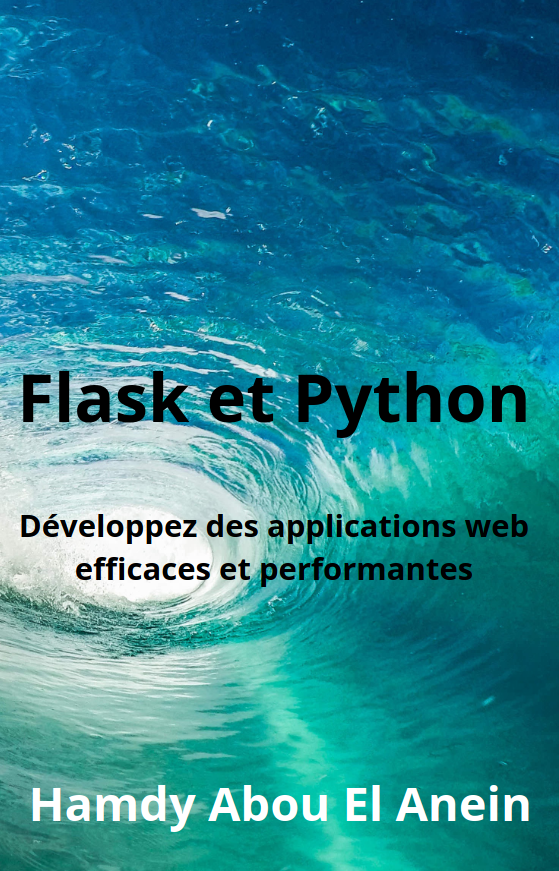

# Programmes du livre : [Flask et Python : Développez des applications web efficaces et performantes](https://www.amazon.fr/dp/B0C2SQ8NW2/ref=tmm_pap_swatch_0?_encoding=UTF8&qid=&sr=)      
       

Auteur : [Hamdy Abou El Anein](https://www.amazon.fr/Hamdy-Abou-El-Anein/e/B0BM89T88X/ref=aufs_dp_fta_dsk)    

